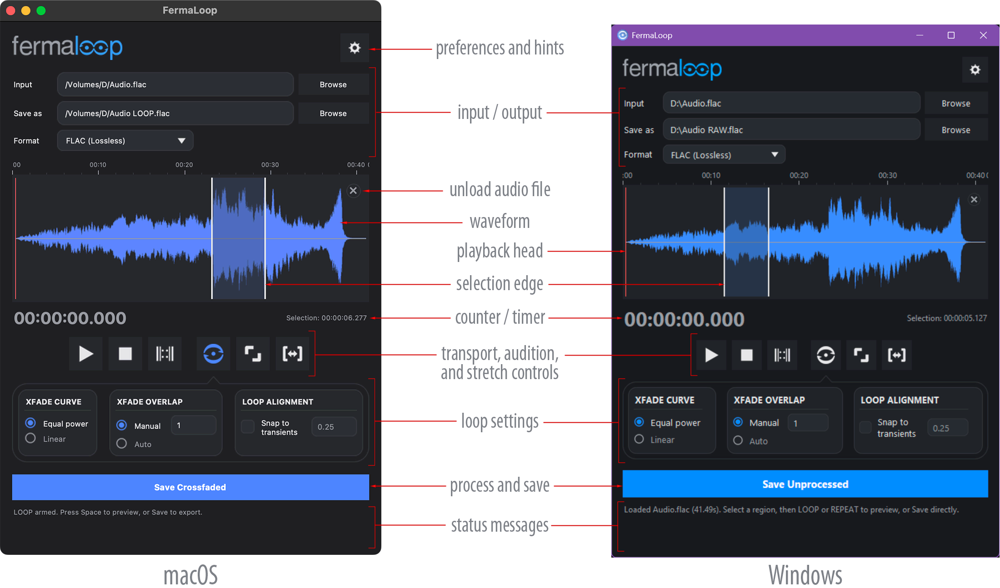
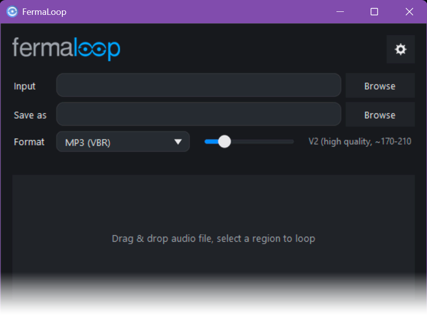
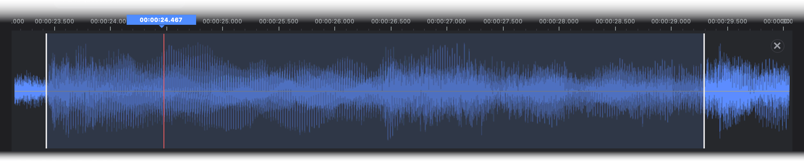
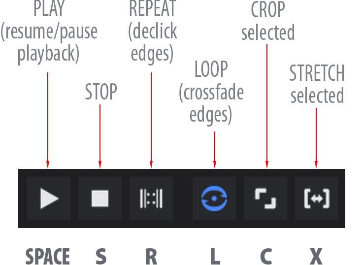
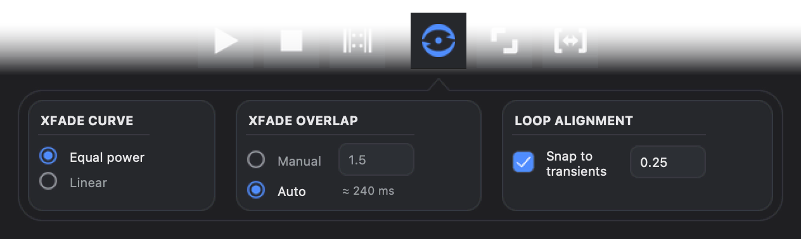
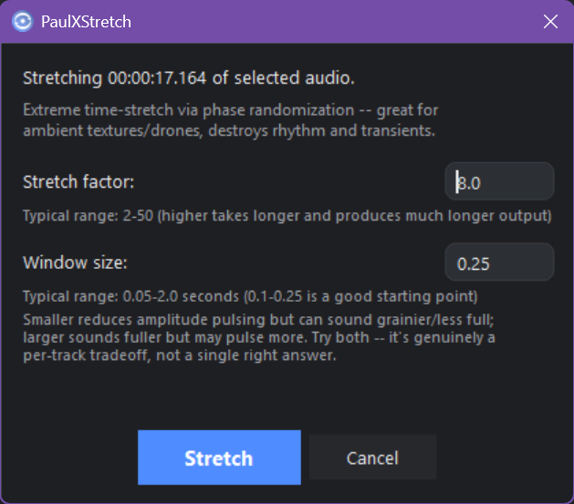
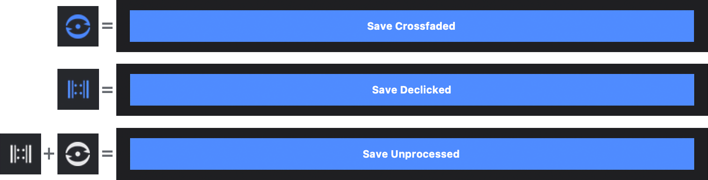
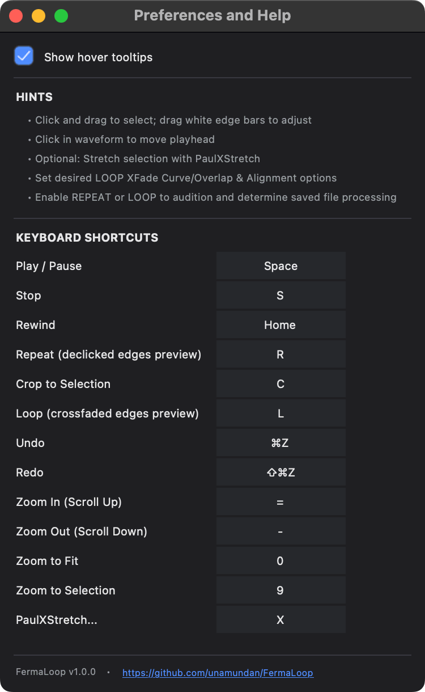

<h1 align="left">
  
</h1>

Turn any short recording into a seamless, endless loop, or stretch it into a long evolving texture — for live theatrical sound design, ambient beds, or anywhere you need audio that plays forever without a click at the seam. **FermaLoop** is a portmanteau which blends *fermata* — the musical notation for a held note or pause, sustained for as long the performer chooses — with *loop,* reflecting the app’s purpose: turning a short audio clip into a seamless, indefinitely extendable loop that a live operator can hold or release on cue, much like a fermata itself.

  

---

## Quick Start

1. **Load** a file — drag it onto the window, or click **Browse**.
2. **Select** the region you want to loop by dragging on the waveform.
3. Click **LOOP** (crossfaded) or **REPEAT** (declicked) to preview it.
4. Adjust crossfade settings if needed — the preview updates live.
5. Click **Save** — it exports exactly what's currently armed (LOOP or
   REPEAT), using your current selection. Cropping first is optional.

---

## Loading Audio

- **Drag and drop** a file anywhere onto the window.
- Or click **Browse** next to **Input** and pick a file.
- Supported formats: WAV, AIFF, MP3, MP4/M4A, FLAC.

  

---

## Selecting & Navigating the Waveform

- **Click and drag** on the waveform to make a selection.
- **Drag the white edge bars** at the selection boundaries to adjust it.
- **Click** anywhere in the waveform to move the playhead there.
- **Hover** over the waveform (without clicking) to see the time at the
  cursor position, shown as a small flag above the ruler.
- **Scroll wheel** zooms in/out, centered on the cursor. Hold **Shift**
  while scrolling to pan instead.
- The small **✕** in the top-right corner of the waveform unloads the
  current file.

  

---

## Transport Controls

These six icons are the actual buttons in the transport row — everything
else (Rewind, Zoom, Undo/Redo) is keyboard-only; see
[Keyboard Shortcuts](#keyboard-shortcuts) below. Deliberately using plain
text here rather than guessed icon glyphs — get the real icon crops from
a screenshot instead of a placeholder attempting to reproduce them.

| Button | Action |
|---|---|
| Play / Pause | Start or pause playback |
| Stop | Stop playback |
| REPEAT | Loop the raw selection with declicked edges |
| LOOP | Loop the selection with a crossfaded seam |
| Crop | Trim the loaded file down to the current selection |
| Stretch | Open PaulXStretch (extreme time-stretch) |

 

  

**LOOP vs. REPEAT — which one do I want?**

- **REPEAT**: plays the raw selection over and over, with just enough
  fade at the wrap point to prevent a click. Fast, no processing, but the
  seam is still audibly "the end of a clip going back to the start."
- **LOOP**: blends the tail of the selection into its head over an
  adjustable crossfade, so the wrap point is inaudible — the loop sounds
  continuous. This is what actually gets *processed* into the saved file.

Only one of the two can be active at a time — enabling one turns the
other off. **Space** starts/pauses whichever is armed; pressing REPEAT or
LOOP again while something is already playing switches to it live,
without stopping playback. **Stop** is the only thing that actually
stops audio.

---

## Crossfade & Loop Options

  

- **XFADE CURVE** — *Equal power* (smoother, constant perceived loudness)
  or *Linear* (simpler, can dip slightly in the middle).
- **XFADE OVERLAP** — *Manual* (type an exact crossfade length in
  seconds) or *Auto* (analyzes the selection and picks a length that
  minimizes an audible seam).
- **LOOP ALIGNMENT** — *Snap to transients*, with an adjustable search
  window, trims the selection to start/end right on the nearest strong
  attack instead of an arbitrary sample boundary.

All three update the LOOP preview live while it's playing — no need to
stop and re-audition after changing a setting.

---

## PaulXStretch (Extreme Time-Stretch)

Stretches the current selection into a long, evolving, textural bed —
based on the “Paul’s Extreme Sound Stretch” technique. Best suited to
ambient/drone material; rhythmic content will smear into texture, which
is inherent to how the technique works, not a bug.

  

- Open it from the **Stretch** button, set the two values below, apply.
- The result replaces the current selection and can be undone
  (**Cmd/Ctrl+Z**) like any other edit.
- Re-audition (LOOP/REPEAT) or Crop afterward to continue building the
  loop from the stretched result.

**Stretch factor** — how much longer the output gets. Typical range
2–50; higher takes longer to compute and produces proportionally longer
output.

**Window size** — the analysis window length, in seconds, the stretch
algorithm processes at a time. Typical range 0.05–2.0s; 0.1–0.25s is a
good starting point.
- **Smaller** windows reduce amplitude pulsing but can sound grainier or
  less full.
- **Larger** windows sound fuller but may pulse more.
- This is a genuine per-track trade-off, not a setting with one correct
  value — try both ends of the range on your material before settling
  on one.

### Credit

FermaLoop’s stretch feature is a from-scratch reimplementation of the
core algorithm behind **Paul’s Extreme Sound Stretch**, created by
[Nasca Octavian Paul](https://www.paulnasca.com/) — the original tool
lives at [hypermammut.sourceforge.net/paulstretch](https://hypermammut.sourceforge.net/paulstretch/).
The name "PaulXStretch" specifically nods to
[Xenakios](https://github.com/essej)'s modern continuation of the
project, [PaulXStretch](https://sonosaurus.com/paulxstretch/) ([source](https://github.com/essej/paulxstretch)),
which FermaLoop’s own feature is named after. No code is shared between
the two — FermaLoop’s implementation is its own — but the technique and
its name both originate there, and crediting that clearly here felt like
the right thing to do.

---

## Cropping (Optional)

Cropping trims the loaded file down to just the current selection. **You
don't need to crop before saving** — Save always processes and exports
only the current selection regardless of whether you’ve cropped. Crop is
useful if you want to keep working with just that trimmed region (e.g.,
before a further Stretch), or want the loaded file itself to match the
final loop length.

---

## Saving

1. Set **Format** — **FLAC** (lossless), **MP4** (Apple Lossless), or
   **MP3** (VBR). These are the only three export formats; input can be
   loaded from a wider set (WAV, AIFF, MP3, MP4/M4A, FLAC), but saving is
   limited to these three.
2. Confirm or change the **Save As** path — it auto-fills next to the
   input file, with a suffix (`LOOP`, `REPEAT`, or `RAW`) that tracks
   whichever mode is currently armed.
3. Click **Save** — the button label itself always reflects what will
   actually happen: *Save Crossfaded*, *Save Declicked*, or *Save
   Unprocessed*.

  

---

## Undo / Redo

**Cmd/Ctrl+Z** / **Shift+Cmd/Ctrl+Z** — covers selection changes, Crop,
and PaulXStretch.

---

## Keyboard Shortcuts

Every shortcut below is remappable — click the ⚙ icon (top right) to open
**Preferences and Help**, then click any shortcut's key and press a new
one to reassign it.

  
| Action | Default key |
|---|---|
| Play / Pause | Space |
| Stop | S |
| Rewind | Home |
| REPEAT (declicked edges preview) | R |
| LOOP (crossfaded edges preview) | L |
| Crop to Selection | C |
| Undo / Redo | Cmd/Ctrl+Z / Shift+Cmd/Ctrl+Z |
| Zoom In / Out | + / − |
| Zoom to Fit | 0 |
| Zoom to Selection | 9 |
| Stretch (open PaulXStretch) | X |

  

---

## Troubleshooting

- **No sound / playback controls greyed out**: the optional
  `sounddevice` package isn't installed — file processing and export
  still work without it.
- **Drag-and-drop doesn't work**: the optional `tkinterdnd2` package
  isn't installed — use **Browse** instead.
- **A Finder window briefly flashes on first launch or first file load
  (macOS only)**: this is normal, one-time macOS behavior tied to
  drag-and-drop and file-dialog initialization, not an app problem. It
  doesn't recur on later launches.

---

## License

MIT — free to use, modify, fork, and distribute, including
commercially, with attribution. See [`LICENSE`](LICENSE) for the full
text.

---

For build/technical details — architecture, dependencies, and the build process — see `DEVELOPMENT.md`.
